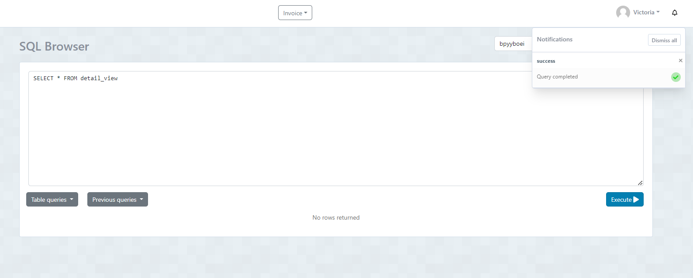
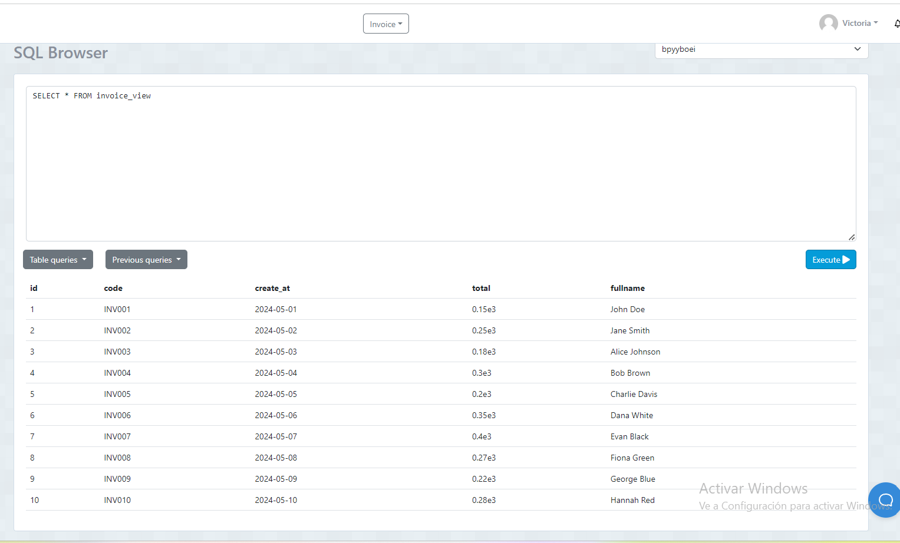

1- Crear nueva table invoice_detail
CREATE TABLE IF NOT EXISTS invoice_detail (
    id SERIAL PRIMARY KEY,
    invoice_id INT,
    product_id INT,
    quantity INT,
    subtotal DECIMAL(9,2),
    FOREIGN KEY (invoice_id) REFERENCES invoice (id),
    FOREIGN KEY (product_id) REFERENCES product (id)
);

2- VIEWS
CREATE VIEW invoice_view AS
SELECT
    i.id,
    i.code,
    i.create_at,
    i.total,
    c.fullname AS fullname
FROM
    invoice i
JOIN
    client c ON i.client_id = c.id;

CAPTURA 

3- VIEW

CREATE VIEW detail_view AS
SELECT
    d.id,
    d.quantity,
    p.description,
    p.price
   
FROM
    invoice_detail d
JOIN
    product p ON d.product_id = p.id;

    CAPTURA 